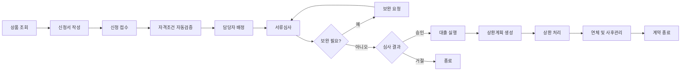

# 프로젝트 개요

## 프로젝트명

공공 정책금융 신청·심사·사후관리 시스템

## 목적

복잡한 자격조건과 심사 절차를 가진 정책금융 업무를 웹에서 일관되게 처리한다. 상품 신청부터 자격검증, 심사, 대출 실행, 상환, 연체관리까지 연결하며 데이터 정합성·보안·추적 가능성을 우선한다.

## 선택 이유

금융공기업 전산 업무의 핵심인 데이터베이스 설계, 트랜잭션, 권한관리, 개인정보보호, 감사로그와 성능 개선을 하나의 업무 흐름에서 검증하기 위해 선택했다. 초기에는 단일 Spring Boot 애플리케이션으로 핵심 원칙을 정확히 구현한다.

## 주요 사용자

| 사용자 | 주요 책임 |
|---|---|
| 고객 | 상품 조회, 신청·서류 제출, 진행 및 상환 내역 조회 |
| 심사 담당자 | 자격검증 확인, 서류심사, 보완 요청, 승인·거절 |
| 사후관리 담당자 | 대출 실행, 상환·연체 및 이상거래 관리 |
| 관리자 | 상품, 규칙, 사용자, 부서와 권한 관리 |
| 감사 담당자 | 개인정보 조회, 상태 변경, 심사와 거래 이력 확인 |

## 전체 업무 흐름

## 핵심 역량

- 금융거래 정확성과 데이터 무결성·정합성
- 명확한 트랜잭션 경계와 부분 실패 대응
- 개인정보 접근통제와 감사로그
- 멱등성 기반 중복거래 방지
- 장애 재현·복구와 대량 데이터 조회 성능 개선

