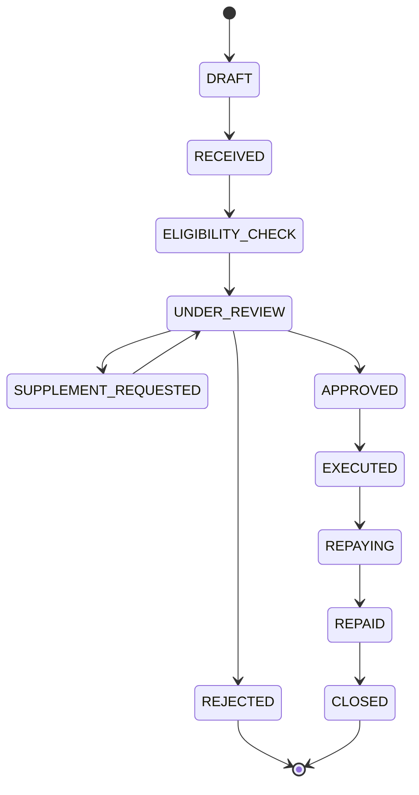

# 신청 상태 흐름

## 상태 정의

| 상태 | 의미 |
|---|---|
| `DRAFT` | 고객이 작성 중이며 아직 접수하지 않음 |
| `RECEIVED` | 필수 입력을 갖춰 접수됨 |
| `ELIGIBILITY_CHECK` | 자동 자격검증 진행 또는 결과 확정 단계 |
| `UNDER_REVIEW` | 담당자에게 배정되어 심사 중 |
| `SUPPLEMENT_REQUESTED` | 고객의 서류·정보 보완 대기 |
| `APPROVED` | 심사 승인됨 |
| `REJECTED` | 심사 거절됨 |
| `EXECUTED` | 대출 실행이 완료됨 |
| `REPAYING` | 상환 진행 중 |
| `REPAID` | 원금·이자 상환 완료 |
| `CLOSED` | 업무·계약 절차 종료 |

## 허용 전이

| 이전 | 이후 | 주체/조건 |
|---|---|---|
| DRAFT | RECEIVED | 고객, 접수 검증 통과 |
| RECEIVED | ELIGIBILITY_CHECK | 시스템 |
| ELIGIBILITY_CHECK | UNDER_REVIEW | 시스템, 검증 결과 저장 완료 |
| UNDER_REVIEW | SUPPLEMENT_REQUESTED | 심사 담당자 |
| SUPPLEMENT_REQUESTED | UNDER_REVIEW | 고객 보완 제출 후 시스템/담당자 |
| UNDER_REVIEW | APPROVED | 권한 있는 심사 담당자 |
| UNDER_REVIEW | REJECTED | 권한 있는 심사 담당자 |
| APPROVED | EXECUTED | 실행 권한자, 거래 성공 |
| EXECUTED | REPAYING | 상환계획 활성화 |
| REPAYING | REPAID | 미납 잔액 0 |
| REPAID | CLOSED | 종료 조건 충족 |

`DRAFT → APPROVED`, `REJECTED → EXECUTED`, `RECEIVED → REPAYING` 등 표에 없는 전이는 금지한다. 거절 후 `CLOSED` 전이 필요 여부와 신청 철회·취소 상태는 TODO이다.

모든 전이는 처리자, 처리일시, 변경 전·후 상태와 변경 사유를 `STATUS_HISTORY`에 기록한다. 동시 변경 충돌 방지를 위해 낙관적 락을 우선 검토한다.

