# ERD 초안

아래 모델은 업무 범위를 확인하기 위한 초안이다. 직원·고객의 인증계정을 통합할지는 아직 결정하지 않았으며 역할 연결과 업무 엔티티 관계를 먼저 정의한다.

```mermaid
erDiagram
    DEPARTMENT ||--o{ EMPLOYEE : belongs_to
    EMPLOYEE ||--o{ EMPLOYEE_ROLE : has
    ROLE ||--o{ EMPLOYEE_ROLE : assigned
    CUSTOMER ||--o{ CUSTOMER_ROLE : has
    ROLE ||--o{ CUSTOMER_ROLE : assigned
    ROLE ||--o{ ROLE_PERMISSION : has
    PERMISSION ||--o{ ROLE_PERMISSION : granted
    CUSTOMER ||--o{ APPLICATION : submits
    FINANCIAL_PRODUCT ||--o{ PRODUCT_RULE_VERSION : versions
    PRODUCT_RULE_VERSION ||--o{ ELIGIBILITY_RULE : contains
    FINANCIAL_PRODUCT ||--o{ APPLICATION : applied_for
    PRODUCT_RULE_VERSION ||--o{ APPLICATION : applied_at
    APPLICATION ||--o{ APPLICATION_DOCUMENT : has
    APPLICATION ||--o{ APPLICATION_ASSIGNMENT : assignment_history
    DEPARTMENT ||--o{ APPLICATION_ASSIGNMENT : responsible_department
    EMPLOYEE ||--o{ APPLICATION_ASSIGNMENT : assigned_employee
    EMPLOYEE ||--o{ APPLICATION_ASSIGNMENT : assigned_by
    APPLICATION ||--o{ SCREENING_RESULT : reviewed_by
    APPLICATION ||--o{ STATUS_HISTORY : changes
    APPLICATION ||--o| LOAN : results_in
    LOAN ||--o{ REPAYMENT_SCHEDULE : schedules
    LOAN ||--o{ FINANCIAL_TRANSACTION : records
    LOAN ||--o{ OVERDUE : incurs
    EMPLOYEE ||--o{ AUDIT_LOG : performs
    CUSTOMER o|--o{ RISK_ALERT : customer_target
    APPLICATION o|--o{ RISK_ALERT : application_target
    LOAN o|--o{ RISK_ALERT : loan_target
    FINANCIAL_TRANSACTION o|--o{ RISK_ALERT : transaction_target
    IDEMPOTENCY_REQUEST ||--o| FINANCIAL_TRANSACTION : protects

    CUSTOMER {
        bigint id PK
    }
    EMPLOYEE {
        bigint id PK
        bigint department_id FK
    }
    DEPARTMENT {
        bigint id PK
    }
    ROLE {
        bigint id PK
    }
    PERMISSION {
        bigint id PK
    }
    EMPLOYEE_ROLE {
        bigint employee_id PK,FK
        bigint role_id PK,FK
    }
    CUSTOMER_ROLE {
        bigint customer_id PK,FK
        bigint role_id PK,FK
    }
    ROLE_PERMISSION {
        bigint role_id PK,FK
        bigint permission_id PK,FK
    }
    FINANCIAL_PRODUCT {
        bigint id PK
    }
    PRODUCT_RULE_VERSION {
        bigint id PK
        bigint product_id FK
    }
    ELIGIBILITY_RULE {
        bigint id PK
        bigint rule_version_id FK
    }
    APPLICATION {
        bigint id PK
        bigint customer_id FK
        bigint product_id FK
        bigint rule_version_id FK
    }
    APPLICATION_DOCUMENT {
        bigint id PK
        bigint application_id FK
    }
    APPLICATION_ASSIGNMENT {
        bigint assignment_id PK
        bigint application_id FK
        bigint department_id FK
        bigint employee_id FK
        bigint assigned_by_employee_id FK
        timestamptz assigned_at
        timestamptz released_at
    }
    SCREENING_RESULT {
        bigint id PK
        bigint application_id FK
        bigint employee_id FK
    }
    STATUS_HISTORY {
        bigint id PK
        bigint application_id FK
    }
    LOAN {
        bigint id PK
        bigint application_id FK,UK
    }
    REPAYMENT_SCHEDULE {
        bigint id PK
        bigint loan_id FK
    }
    FINANCIAL_TRANSACTION {
        bigint id PK
        bigint loan_id FK
    }
    OVERDUE {
        bigint id PK
        bigint loan_id FK
    }
    AUDIT_LOG {
        bigint id PK
        bigint employee_id FK
    }
    RISK_ALERT {
        bigint id PK
        bigint customer_id FK
        bigint application_id FK
        bigint loan_id FK
        bigint transaction_id FK
    }
    IDEMPOTENCY_REQUEST {
        bigint id PK
        string idempotency_key UK
    }
```

## 미확정 사항

- 고객 인증계정과 직원 인증계정의 공통 `USER_ACCOUNT` 도입 여부. 현재 ERD의 `CUSTOMER_ROLE`과 `EMPLOYEE_ROLE`은 업무 주체 기준 MVP 연결이며 인증계정 구조 확정 시 재검토한다.
- `EMPLOYEE_ROLE`, `CUSTOMER_ROLE`, `ROLE_PERMISSION`의 `valid_from`/`valid_to` 적용은 향후 확장 사항이다.
- `APPLICATION 1:1 LOAN`은 선택적 1:0..1 관계로 구현
- MVP는 직원이 수행하는 수동 배정만 지원한다. 향후 자동 배정을 도입할 때 시스템 행위자 표현 방식과 `assigned_by_employee_id` nullable 변경 여부를 결정한다.
- `RISK_ALERT`가 여러 대상 FK를 동시에 참조할 수 있는지, 정확히 하나만 허용할지 여부
- 문서 저장소 구조
- 개인정보 암호화 컬럼 및 검색용 해시 컬럼
